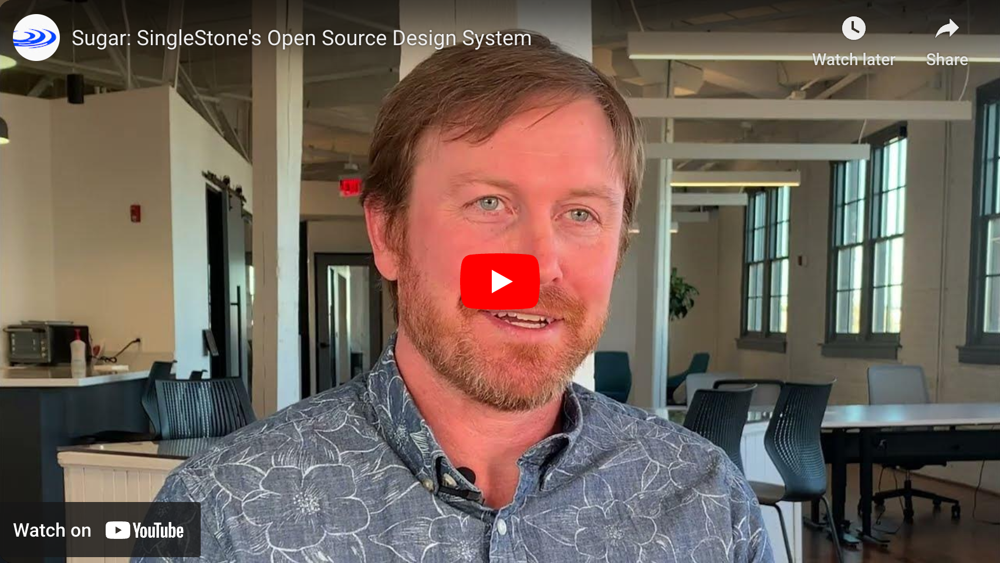

<h1 align="center">Welcome to @singlestone/sugar 👋</h1>

  
  
  

> SingleStone's sweet design system.

## Table of Contents

<!-- START doctoc generated TOC please keep comment here to allow auto update -->
<!-- DON'T EDIT THIS SECTION, INSTEAD RE-RUN doctoc TO UPDATE -->

- [What is Sugar?](#what-is-sugar)
- [Packages](#packages)
- [Author](#author)
- [🤝 Contributing](#-contributing)
- [📝 License](#-license)

<!-- END doctoc generated TOC please keep comment here to allow auto update -->

## What is Sugar?

Click the image below for a video explanation.

## Packages

We have two packages of note, click their links below to go to their respective READMEs:

- [`@singlestone/sugar`](./sugar/sugar) - TailwindCSS plugin that makes implementing our design system a breeze.
- [`@singlestone/sugar-react`](./sugar/react) - React bindings for the Tailwind plugin.

## Author

👤 **SingleStone**

- Website: <https://www.singlestoneconsulting.com/>
- Twitter: [@SingleStoneTech](https://twitter.com/SingleStoneTech)
- Github: [@singlestone](https://github.com/singlestone)
- LinkedIn: [@singlestone](https://www.linkedin.com/company/singlestone)

## 🤝 Contributing

Contributions, issues and feature requests are welcome! Feel free to check
[issues page](https://github.com/singlestone/sugar/issues). You can also take a look at the
[contributing guide](https://github.com/singlestone/sugar/blob/main/CONTRIBUTING.md).

## 📝 License

Copyright © 2023 [SingleStone Consulting](https://github.com/singlestone). 
This project is [MIT](https://github.com/singlestone/sugar/blob/main/LICENSE) licensed.

---

_This README was generated with ❤️ by [readme-md-generator](https://github.com/kefranabg/readme-md-generator)_
